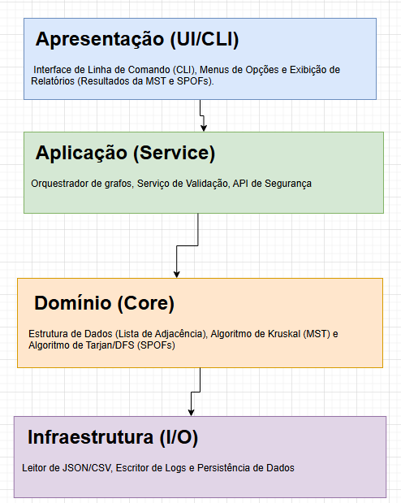

# E2 — Design Técnico, Arquitetura e Backlog

> **Disciplina:** Teoria dos Grafos  
> **Prazo:** 21 de abril de 2026  
> **Peso:** 20% da nota final  

---

## Identificação do Grupo

| Campo | Preenchimento |
|-------|---------------|
| Nome do projeto | GraphDefend |
| Repositório GitHub | https://github.com/karenjustino/Graphdefend|
| Integrante 1 | Gabriel Anastácio Pereira — RGM 4548985 |
| Integrante 2 | Aliana Sthefani Moraes da Silva — RGM 39166856 |
| Integrante 3 | Karen Gabrielle Justino — RGM 45040672 |
---

## 1. Algoritmos Escolhidos

### 1.1 Algoritmo Principal

| Campo | Resposta |
|-------|----------|
| Nome do algoritmo | Algoritmo de Kruskal |
| Categoria | Algoritmo Guloso (Greedy) |
| Complexidade de tempo | O(E \log E) ou O(E \log V) |
| Complexidade de espaço | O(V + E) |
| Problema que resolve | Cálculo e extração da Árvore Geradora Mínima (MST) da camada física da rede. |

**Por que este algoritmo foi escolhido?**
Foi definido como o núcleo analítico do projeto para realizar a extração da MST. Para o contexto de segurança e infraestrutura (onde os dispositivos são vértices V e as conexões são arestas E), a MST é fundamental para projetar um backbone que garanta a conectividade total da operação ao menor custo (latência) possível. O uso do algoritmo elimina redundâncias não essenciais, minimizando a superfície de ataque a agentes maliciosos.

**Alternativa descartada e motivo:**
| Algoritmo alternativo | Motivo da exclusão |
|-----------------------|--------------------|
| Algoritmo de Prim | As redes de computadores modeladas são caracteristicamente esparsas. O Kruskal, alinhado ao uso obrigatório da estrutura de Lista de Adjacência, apresenta eficiência superior no processamento de arestas em grafos esparsos em comparação a implementações de Prim baseadas em matrizes tradicionais. |

**Limitações no contexto do problema:**
Ao processar topologias com simulações de larga escala (limite estabelecido de até 10.000 nós), a complexidade de tempo impõe restrições de usabilidade, podendo dar a impressão de travamento do sistema. É obrigatório mitigar isso fornecendo feedback visual (barras de progresso/logs) via CLI durante a execução.

**Referência bibliográfica:**

ALMUTAIRI, A. Graph-Theoretic Approaches to Resilience: Strengthening AI Systems Against Coordinated Cyberattacks. *International Journal of Computer Applications*, Nova York, v. 187, n. 39, p. 1-8, 2025. Disponível em: https://www.ijcaonline.org/archives/volume187/number39/almutairi-2025-ijca-925679.pdf.

---

### 1.2 Algoritmo Adicional *(se houver)*
| Campo | Resposta |
|-------|----------|
| Nome do algoritmo | Algoritmo de Tarjan / Busca em Profundidade (DFS) |
| Categoria | Algoritmo de Busca em Grafos |
| Complexidade de tempo | O(V + E)|
| Complexidade de espaço | O(V)$ |

**Justificativa:**

Este algoritmo soluciona o problema central de diagnóstico de vulnerabilidades estruturais no projeto (identificação de Single Points of Failure - SPOFs). O algoritmo de Tarjan baseado em DFS identifica todos os vértices de articulação de forma eficiente em uma única passagem pelo grafo, permitindo visualizar quais nós derrubariam a rede em caso de falha ou ataque.

**Referência bibliográfica:**

> GOMES, P. F. Uma introdução à Ciência de Redes e Teoria de Grafos. *Revista Brasileira de Ensino de Física*, São Paulo, v. 46, e20240190, 2024. Disponível em: https://doi.org/10.1590/1806-9126-RBEF-2024-0190.

---

## 2. Arquitetura em Camadas




### Descrição das camadas
| Camada | Responsabilidade | Artefatos principais |
|--------|-----------------|----------------------|
| **Apresentação (UI/CLI)** | Interface de interação direta e exclusiva com o usuário. | Interface de Linha de Comando (CLI), Menus de Opções, Exibição de Relatórios. |
| **Aplicação (Service)** | Funciona como o orquestrador do sistema, gerindo o fluxo de execução e as regras de negócio. | Orquestrador de Grafos, Serviço de Validação, API de Segurança. |
| **Domínio (Core)** | Contém a lógica matemática e as estruturas de dados fundamentais, isolada de I/O. | Estrutura de Lista de Adjacência, Algoritmo de Kruskal (MST), Algoritmo de Tarjan (SPOFs). |
| **Infraestrutura (I/O)** | Especializada na manipulação de dados externos, leitura e persistência. | Leitor de JSON/CSV, Escritor de Logs e Dados. |

---

---

## 3. Estrutura de Diretórios

```
## 3. Estrutura de Diretórios

```text
GraphDefend/
├── docs/
│   ├── E1_template.md
│   ├── E2_template.md
│   └── arquitetura_e2.png
├── src/
│   ├── core/
│   │   ├── graph.py          
│   │   └── adjacency_list.py
│   ├── algorithms/
│   │   ├── kruskal.py      
│   │   └── tarjan.py      
│   ├── service/
│   │   └── orchestrator.py
│   ├── ui/
│   │   └── cli_menus.py
│   ├── io/
│   │   └── file_reader.py
│   └── main.py
├── tests/
│   ├── test_graph.py
│   └── test_algorithms.py
├── data/
│   └── topologia.json
└── requirements.txt
```

> **Justificativa de desvios** *(se houver)*: 

---

## 4. Definição do Dataset

**Formato de entrada aceito:**

O sistema consumirá dados no formato JSON, sendo a estrutura composta por uma lista de declaração de vértices e uma lista de arestas indicando explicitamente a origem, o destino e o peso (latência/custo).

**Exemplo de estrutura do arquivo de entrada:**

```json
{
  "vertices": ["A", "B", "C", "D"],
  "arestas": [
    { "origem": "A", "destino": "B", "peso": 4 },
    { "origem": "A", "destino": "C", "peso": 2 },
    { "origem": "B", "destino": "D", "peso": 5 },
    { "origem": "C", "destino": "D", "peso": 1 }
  ]
}
```

**Estratégia de geração aleatória:**

| Parâmetro | Descrição |
|-----------|-----------|
| Número de vértices | Tamanho do grafo, configurável via argumento no menu (N nós). |
| Densidade |Probabilidade (0.0 a 1.0) de existência de conexões gerada aleatoriamente.|
| Faixa de pesos | Intervalo (mín/máx) aleatório para representar latência em milissegundos|

---

## 5. Backlog do Projeto

### 5.1 In-Scope — O que será implementado
| # | Funcionalidade | Prioridade | Critério de aceite |
|---|----------------|------------|--------------------|
| 1 | Importação de Dataset | Alta | **Dado** um arquivo JSON válido em `/data`, **quando** o usuário selecionar a importação, **então** o sistema deve carregar a estrutura e exibir a quantidade total de vértices e arestas na CLI. |
| 2 | Cálculo de Árvore Geradora Mínima | Alta | **Dado** um grafo ponderado carregado, **quando** o usuário solicitar o algoritmo de Kruskal, **então** o sistema deve exibir o custo total do backbone e a lista textual das arestas mantidas. |
| 3 | Identificação de Pontos de Articulação (SPOFs) | Alta | **Dado** um grafo de rede carregado na CLI, **quando** o usuário executar a análise de vulnerabilidade (Algoritmo de Tarjan), **então** o sistema deve listar nominalmente todos os vértices cuja remoção desconecta o grafo. |
| 4 | Simulação de Falhas de Nós | Média | **Dado** um grafo carregado e um nó selecionado para remoção, **quando** a simulação for executada, **então** o sistema deve emitir um alerta indicando se a rede permaneceu conexa ou se foi fragmentada. |
| 5 | Gerador de Grafos Aleatórios | Baixa | **Dado** os parâmetros de N vértices e densidade D, **quando** o usuário confirmar a geração, **então** o sistema deve salvar um arquivo JSON válido no diretório `/data` e exibir o caminho do arquivo gerado. |


### 5.2 Out-of-Scope — O que NÃO será feito

Funcionalidade excluída | Motivo |
|------------------------|--------|
| Interface Gráfica (GUI) avançada | O foco técnico do projeto é a implementação de algoritmos de grafos e interação via terminal (CLI). |
| Integração com redes físicas reais | Exigiria acesso a infraestruturas dinâmicas de TI fora do escopo acadêmico. |
| Análise de rede via Inteligência Artificial | A complexidade de IA não é necessária para cumprir os objetivos de algoritmos clássicos de grafos. |

---

## Checklist de Entrega

- [x] Big-O de tempo e espaço declarados para cada algoritmo
- [x] Ao menos 1 alternativa descartada com justificativa
- [x] Diagrama de arquitetura com 4 camadas identificadas
- [x] Referência bibliográfica para cada algoritmo (ABNT ou IEEE)
- [x] Backlog com ≥ 5 itens In-Scope e ≥ 3 Out-of-Scope
- [x] Ao menos 3 critérios de aceite no formato "dado / quando / então"
- [x] Exemplo de estrutura de arquivo de entrada presente

---

*Teoria dos Grafos — Profa. Dra. Andréa Ono Sakai*
