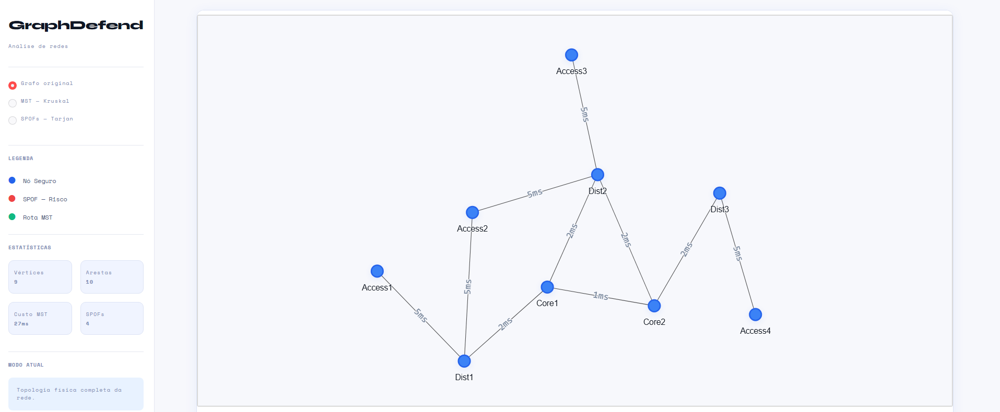
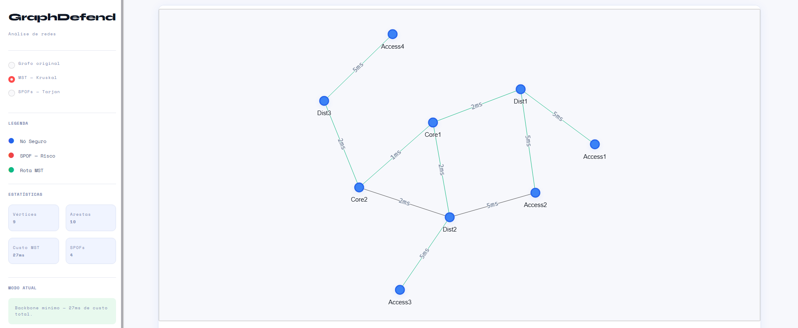
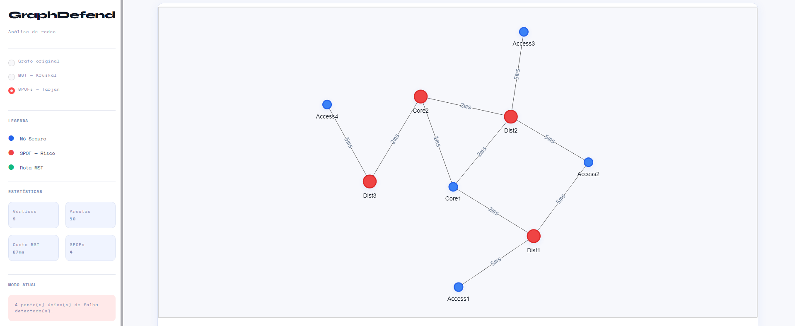

# E3 — MVP: Núcleo Funcional com Primeiras Telas

> **Disciplina:** Teoria dos Grafos  
> **Prazo:** 10 de maio de 2026  
> **Peso:** 25% da nota final  

---

## Identificação do Grupo

| Campo | Preenchimento |
|-------|---------------|
| Nome do projeto | GraphDefend |
| Repositório GitHub | <https://github.com/karenjustino/Graphdefend>|
| Integrante 1 | Gabriel Anastácio Pereira — RGM 4548985 |
| Integrante 2 | Aliana Sthefani Moraes da Silva — RGM 39166856 |
| Integrante 3 | Karen Gabrielle Justino — RGM 45040672 |

---

## 1. Como Executar o MVP

**Pré-requisitos:**

```
Python 3.11+
pip (gerenciador de pacotes Python)
```

**Instalação:**

```bash
git clone https://github.com/karenjustino/Graphdefend.git
cd Graphdefend
pip install -r requirements.txt

```

**Execução:**

```bash
python -m streamlit run src/ui/app.py
```

**Saída esperada:**

```
[+] SPOFs encontrados: ['Dist1', 'Dist2', 'Dist3', 'Core2']
[+] Custo MST: 27ms
[+] Arestas MST: [('Core1','Core2',1),('Core1','Dist1',2),...]
[+] Interface gerada: /caminho/grafo_temp.html

```

---

## 2. Algoritmo Implementado

| Campo | Resposta |
|-------|----------|
| Nome do algoritmo | Algoritmo de Kruskal |
| Arquivo de implementação | src/algorithms/kruskal.py |
| Complexidade de tempo | O(E log E) ou O(E log V) |
| Complexidade de espaço | O(V + E) |

**Trecho do código com comentário de Big-O:**

```python

# Kruskal 

arestas.sort(key=lambda item: item[2])

# O(V) — inicializa Union-Find com todos os vértices
uf = UnionFind(self.graph.get_vertices())

# O(E) — itera por cada aresta uma única vez
for origem, destino, peso in arestas:
    # O(α(V)) amortizado — quase O(1) na prática (compressão de caminho)
    if uf.union(origem, destino):
        mst_arestas.append((origem, destino, peso))
        custo_total += peso

# Tarjan 

for vertex in self.graph.get_vertices():
    self.parent[vertex] = None

# O(V + E) total — DFS visita cada vértice e aresta exatamente uma vez
for vertex in self.graph.get_vertices():
    if vertex not in self.discovery_time:
        self._dfs(vertex)

# Dentro da DFS — O(1) por chamada:
# Regra 1: raiz com 2+ filhos independentes → SPOF
if self.parent[u] is None and children > 1:
    self.spofs.add(u)

# Regra 2: nó sem caminho alternativo acima de si → SPOF
if self.parent[u] is not None and self.lowest_reachable_time[v] >= self.discovery_time[u]:
    self.spofs.add(u)
```

---

## 3. Estrutura do Repositório

> Confirme que a estrutura implementada está de acordo com o E2.

```text
GraphDefend/
├── docs/
│   ├── E1A_Aliana_Karem_GabrielAnsatacio.md
│   ├── E2_GraphDefend_Designer_técnico.md
│   └── E3_Template.md
├── src/
│   ├── core/
│   │   └── graph.py
│   ├── algorithms/
│   │   ├── kruskal.py      
│   │   └── tarjan.py 
│   ├── ui/
│   │   ├── app.py
│   │   └── visualizer.py
│   └── io/
│       └── file_reader.py
├── tests/
│   ├── test_algorithms.py
│   └── test_graph.py
├── data/
│   └── topologia.json
└── requirements.txt
```

**Desvios em relação ao E2** *(se houver)*:
#### Elevação de Escopo (Overdelivery): No E2, a interface prevista era exclusivamente via linha de comando (CLI). Para o MVP, desenvolvemos uma Interface Gráfica interativa utilizando Streamlit e Pyvis (pasta src/ui/) para permitir análises visuais de cada grafo
---

## 4. Telas do MVP

> Insira screenshots ou gravações da interface funcionando.

### Tela de Entrada



*Descrição:* Dashboard principal rodando via Streamlit. O painel lateral exibe os controles de visualização e métricas calculadas em tempo real (quantidade de vértices, arestas, custo total do backbone e total de vulnerabilidades). O painel central exibe o grafo interativo renderizado.

### Tela de Resultado



*Descrição:*  Quando o filtro é acionado, a física da rede se ajusta. Em vermelho são destacados os nós de alto risco (Single Points of Failure detectados pelo Tarjan), e em verde as rotas essenciais de menor latência da Árvore Geradora Mínima (Kruskal)




*Descrição:*  Interface do sistema exibindo a análise de vulnerabilidades em tempo real. O painel lateral apresenta as métricas da topologia importada (9 vértices e 10 arestas) e indica a detecção de 4 Pontos Únicos de Falha (SPOFs). No painel central, a renderização interativa destaca em vermelho os nós críticos identificados pelo algoritmo de Tarjan (Core2, Dist1, Dist2 e Dist3). A visualização deixa claro que a queda de qualquer um desses nós fragmentaria a comunicação da rede, auxiliando na rápida tomada de decisão para mitigação de riscos. Os pesos nas conexões representam a latência em milissegundos.


---

## 5. Testes Unitários

| Algoritmo | Caso de teste | Status | Comando para executar |
|-----------|--------------|--------|----------------------|
| Kruskal (MST) | Caso base (Custo total e arestas) | ✅ | `pytest tests/test_algorithms.py::test_kruskal_calcula_mst` |
| Kruskal (MST) | Grafo desconexo | ✅ | `pytest tests/test_algorithms.py::test_kruskal_grafo_desconexo` |
| Tarjan (SPOF) | Caso base (Vulnerabilidade no nó) | ✅ | `pytest tests/test_algorithms.py::test_tarjan_identifica_spof` |
| Tarjan (SPOF) | Grafo sem SPOF | ✅ | `pytest tests/test_algorithms.py::test_tarjan_sem_spof` |
| Graph (Core) | Grafo vazio | ✅ | `pytest tests/test_graph.py::test_grafo_vazio` |
| Graph (Core) | Criação de nós e arestas | ✅ | `pytest tests/test_graph.py::test_criacao_vertices_e_arestas` |

**Como rodar todos os testes:**

```bash
pytest tests/
```
ou
```bash
python -m pytest tests/
```

**Resultado atual:**

```text
============================= test session starts ==============================
platform win32 -- Python 3.13.3, pytest-9.0.3, pluggy-1.6.0
rootdir: C:\Users\Usuario\Documents\Graphdefend
configfile: pytest.ini
plugins: anyio-4.13.0
collected 6 items

tests\test_algorithms.py ....                                             [ 66%]
tests\test_graph.py ..                                                   [100%]

============================== 6 passed in 0.05s ===============================
```


## 6. Histórico de Commits

> Liste os 5+ commits mais relevantes desta entrega.

| Hash (7 chars) | Mensagem | Autor |
|----------------|----------|-------|
| `86384ab` | Merge pull request #2 from karenjustino/release/mvp-e3 | Karen Justino |
| `cf398f7` | Merge branch 'main' into release/mvp-e3 | Karen Justino |
| `b11219e` | feat: consolida MVP e interface web para testes internos acadêmicos | Karen Justino |
| `3c4e64a` |  (HEAD -> minha-primeira-contribuicao, origin/main, origin/HEAD) Add files via upload |Gabriel Anastacio |
| `87acf06` | 87acf06 Merge pull request #1 from karenjustino/minha-primeira-contribuicao| Gabriel Anastacio |
| b5e8a14   | (origin/minha-primeira-contribuicao) Adicionando o primeiro README | Gabriel Anastacio |
--

## 7. O que está funcionando / O que ainda falta

| Funcionalidade | Status | Observação |
|---------------|--------|------------|
| Classe do grafo | ✅ Completo | Estrutura de Lista de Adjacência otimizada para redes esparsas. |
| Algoritmo principal | ✅ Completo | Kruskal (MST) e Tarjan (SPOFs) implementados e validados. |
| Leitura de arquivo | ✅ Completo | Importação de topologias via JSON seguindo o esquema técnico definido. |
| Tela de entrada | ✅ Completo | Dashboard em Streamlit com menus laterais e seleção de modos de visualização. |
| Tela de resultado | ✅ Completo | Renderização dinâmica em HTML/Pyvis com física de partículas e legendas. |
| Testes unitários | ✅ Completo | Todos os testes planejados para o MVP foram aprovados com sucesso (4/4). |
| Simulação de falhas | 🔄 Parcial | A lógica de identificação de riscos está pronta, mas a remoção dinâmica de nós em tempo real está no backlog. |
| Gerador de grafos | ⏳ Pendente | Funcionalidade planejada para a fase final do projeto, permitindo geração e importação de topologias aleatórias de larga escala. |
---

---

## Checklist de Entrega

- [x] Repositório público e acessível
- [x] .gitignore configurado
- [x] README com instruções de execução do MVP
- [x] Algoritmo principal executando sem erros
- [x] Tela de entrada e tela de resultado demonstráveis
- [x] 3 testes unitários por algoritmo (mínimo caso base passando)
- [x] ≥ 5 commits com prefixos semânticos (feat:, fix:, test:, docs:)
- [x] Ao menos 1 arquivo de grafo de exemplo em `data/`

---

*Teoria dos Grafos — Profa. Dra. Andréa Ono Sakai*
